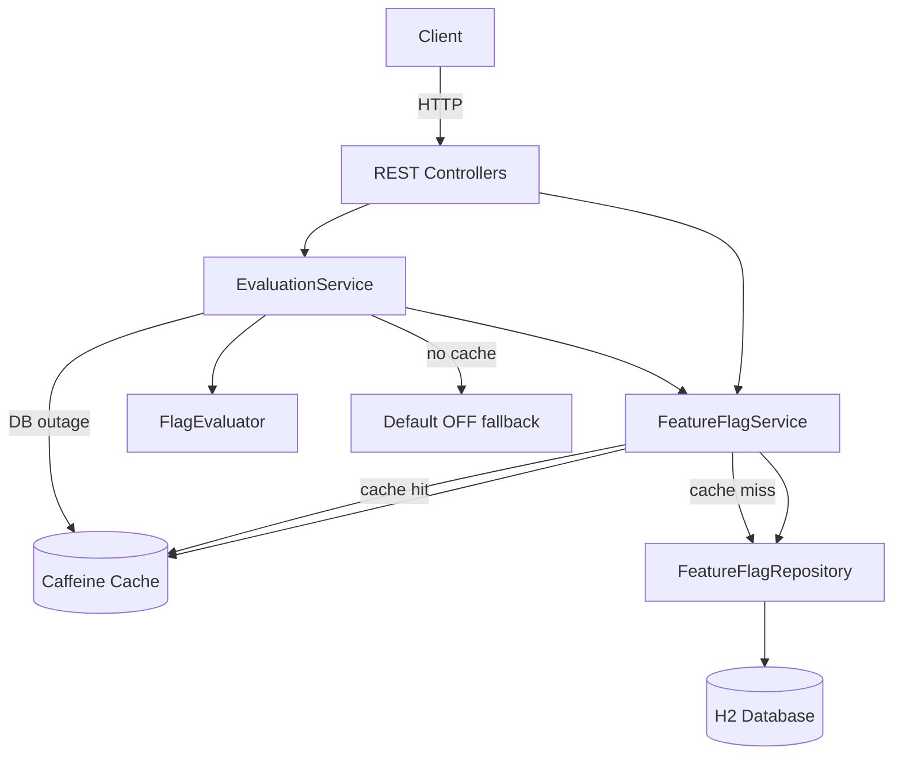
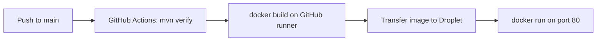

# Feature Flags API

Production-ready REST API for storing feature flags, managing flag states, and evaluating feature availability based on user context attributes.

Built with **Java 21** and **Spring Boot 3**.

## Features

- Persistent flag storage (name, default state, contextual rules)
- Context-aware evaluation endpoint (`userId`, `subscriptionTier`, `region`, etc.)
- In-memory Caffeine cache to avoid database lookups on every evaluation
- Deterministic percentage rollout using SHA-256 hash of `userId`
- Validation and structured error responses
- Graceful fallback to cached data (or OFF) when the database is unavailable
- Unit and integration tests
- GitHub Actions CI pipeline

## Architecture



### Request lifecycle (evaluation)

1. Client sends `POST /api/v1/flags/{name}/evaluate` with a context payload.
2. `EvaluationService` loads the flag via `FeatureFlagService`.
3. Cache is checked first; on miss, the flag is loaded from H2 and cached.
4. `FlagEvaluator` applies rules in priority order.
5. If no rule matches, percentage rollout is evaluated deterministically from `userId`.
6. If still unmatched, the flag's default state is returned.
7. If the database is unavailable, a cached copy is used; otherwise evaluation falls back to OFF.

## Prerequisites

- Java 21+
- Maven 3.9+

## Quick start

```bash
cd feature-flags-api
mvn spring-boot:run
```

The API starts at `http://localhost:8080`.

Run tests:

```bash
mvn test
```

## API reference

### Create a flag

```bash
curl -X POST http://localhost:8080/api/v1/flags \
  -H "Content-Type: application/json" \
  -d '{
    "name": "new-dashboard",
    "defaultState": false,
    "percentageRollout": 25,
    "rules": [
      {
        "priority": 1,
        "enabled": true,
        "conditions": [
          { "attribute": "subscriptionTier", "operator": "EQUALS", "value": "premium" }
        ]
      },
      {
        "priority": 2,
        "enabled": true,
        "conditions": [
          { "attribute": "region", "operator": "IN", "value": ["US", "EU"] }
        ]
      }
    ]
  }'
```

### List flags

```bash
curl http://localhost:8080/api/v1/flags
```

### Get a flag

```bash
curl http://localhost:8080/api/v1/flags/new-dashboard
```

### Update a flag

```bash
curl -X PUT http://localhost:8080/api/v1/flags/new-dashboard \
  -H "Content-Type: application/json" \
  -d '{
    "defaultState": false,
    "percentageRollout": 50,
    "rules": []
  }'
```

### Evaluate a flag

```bash
curl -X POST http://localhost:8080/api/v1/flags/new-dashboard/evaluate \
  -H "Content-Type: application/json" \
  -d '{
    "context": {
      "userId": "user-123",
      "subscriptionTier": "premium",
      "region": "US"
    }
  }'
```

Example response:

```json
{
  "flagName": "new-dashboard",
  "enabled": true,
  "reason": "Matched rule priority 1"
}
```

### Delete a flag

```bash
curl -X DELETE http://localhost:8080/api/v1/flags/new-dashboard
```

## Rule operators

| Operator    | Description                          |
|-------------|--------------------------------------|
| `EQUALS`    | Attribute equals value               |
| `NOT_EQUALS`| Attribute does not equal value       |
| `IN`        | Attribute is in list of values       |
| `NOT_IN`    | Attribute is not in list of values   |
| `CONTAINS`  | Attribute string contains value      |

Rules are evaluated in ascending `priority` order. The first matching rule wins.

## Percentage rollout

When no rule matches, a configured `percentageRollout` (0–100) enables the flag for a deterministic subset of users:

```
bucket = SHA-256(flagName + ":" + userId) mod 100
enabled = bucket < percentageRollout
```

The same user always receives the same result for a given flag.

## Configuration

| Property                         | Default | Description                |
|----------------------------------|---------|----------------------------|
| `featureflags.cache.ttl-seconds` | 300     | Cache entry TTL            |
| `featureflags.cache.max-size`    | 1000    | Maximum cached flags       |
| `server.port`                    | 8080    | HTTP port                  |

## Error handling

- `400` — invalid request payload or context
- `404` — flag not found
- `409` — flag already exists

Database outages during evaluation fall back to cached flag definitions when available; otherwise the API returns `enabled: false` with reason `Database unavailable, default fallback OFF`.

## Project structure

```
src/main/java/com/featureflags/
├── controller/     REST endpoints
├── service/        Business logic and caching
├── evaluation/     Rule and rollout evaluation
├── model/          JPA entities
├── dto/            Request/response objects
├── config/         Cache and exception handling
└── repository/     Data access
```

## CI/CD

- **CI** — GitHub Actions runs `mvn verify` on push and pull requests (`.github/workflows/ci.yml`)
- **Deploy** — On push to `main`, GitHub Actions runs tests, builds the Docker image on GitHub runners, transfers it to the Droplet, and starts the container (`.github/workflows/deploy.yml`)

## Docker

Build and run locally:

```bash
docker build -t feature-flags-api .
docker run --rm -p 8080:8080 -v featureflags-data:/app/data feature-flags-api
```

Test:

```bash
curl http://localhost:8080/api/v1/flags
```

## Deploy to DigitalOcean Droplet

### Architecture



### One-time setup

#### 1. Create a Droplet

1. Go to https://cloud.digitalocean.com → **Create → Droplets**
2. **Image:** Ubuntu 22.04
3. **Size:** Basic **2 GB RAM** recommended (image transfer + runtime; build happens on GitHub, not the Droplet)
4. **Authentication:** Add your SSH public key
5. Create the Droplet and note its **IP address**

#### 2. Prepare the Droplet

SSH in and run the setup script:

```bash
ssh root@YOUR_DROPLET_IP

# Install Git, Docker, and configure firewall
curl -fsSL https://raw.githubusercontent.com/Prajal12345/feature-flags-api/main/scripts/droplet-setup.sh | bash
```

Or copy `scripts/droplet-setup.sh` to the Droplet and run it manually.

#### 3. Create a deploy SSH key for GitHub Actions

On your local machine:

```bash
ssh-keygen -t ed25519 -C "github-actions-deploy" -f github-actions-deploy -N ""
```

- Add the **public** key (`github-actions-deploy.pub`) to the Droplet:

```bash
ssh root@YOUR_DROPLET_IP "mkdir -p ~/.ssh && cat >> ~/.ssh/authorized_keys" < github-actions-deploy.pub
```

- Keep the **private** key (`github-actions-deploy`) for GitHub secrets

#### 4. Add GitHub repository secrets

Open: https://github.com/Prajal12345/feature-flags-api/settings/secrets/actions

| Secret | Value |
|--------|-------|
| `DROPLET_HOST` | Droplet IP address |
| `DROPLET_USER` | `root` (or your SSH user) |
| `DROPLET_SSH_KEY` | Full private key contents (`github-actions-deploy`) |

No Container Registry or DigitalOcean API token is required.

### Deploy

Push to `main` (or run the **Deploy** workflow manually from the Actions tab):

```bash
git push origin main
```

The workflow will:

1. Run tests (`mvn verify`) on GitHub Actions
2. Build the Docker image on GitHub Actions (avoids OOM on small Droplets)
3. Transfer the image to the Droplet over SSH
4. Run the container on **port 80**

Verify:

```bash
curl http://YOUR_DROPLET_IP/api/v1/flags
```

### Manual deploy on the Droplet (optional)

```bash
cd /opt/feature-flags-api
git pull origin main
docker build -t feature-flags-api:latest .
docker compose -f docker-compose.prod.yml up -d --build
```

### Configuration

| Variable | Default (local) | Production (Droplet) |
|----------|-----------------|----------------------|
| `SERVER_PORT` | `8080` | `8080` (mapped to host port 80) |
| `SPRING_DATASOURCE_URL` | `./data/featureflags` | `/app/data/featureflags` (Docker volume) |
| `SPRING_H2_CONSOLE_ENABLED` | `true` | `false` |

Data is stored in the Docker volume `featureflags-data` and survives container restarts/redeploys.

## License

MIT
